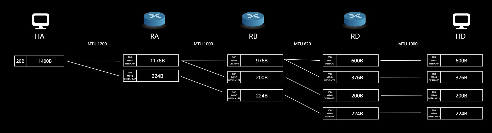

1. El Host A quiere enviar 1400 Bytes de datos en datagramas IP al Host D. Los datagramas siguen el camino HA → RA → RB → RD → HD. Determinar los tamaños y offsets de la secuencia de fragmentos entregados a la capa IP en la máquina destino. Asuma encabezados IP de 20 bytes.

   
___
2. Confeccionar las tablas de ruteo de los dispositivos HA, RA, RB, RD y HD, de manera tal que exista la comunicación HA → HD y HD → HA

###  HA
>  ip route add default via 170.16.255.252
### RA
> ip route add 129.30.192.64/26 via 192.168.50.130
### RB
> ip route add 129.30.192.64/26 via 192.168.50.146
> ip route add 170.16.128.0/17 via 192.168.50.129
### RD
> ip route add 170.16.128.0/17 via 192.168.50.145
### HD
> ip route add default via 129.30.192.124
___
2. Confeccionar el laboratorio

3. Asignar las direcciones IP a cada dispositivo

4. Cambiar el MTU de las redes que tengan valor menor a 1500
### HA
> ip link set dev eth0 mtu 1200
### RA
> ip link set dev eth0 mtu 1200
> ip link set dev eth1 mtu 1000
### RB
> ip link set dev eth1 mtu 1000
> ip link set dev eth3 mtu 620
### RD
> ip link set dev eth0 mtu 1000
> ip link set dev eth2 mtu 620
### HD
> ip link set dev eth0 mtu 1000
2. Asignar las rutas correspondientes para la comunicación HA→HD y HD→HA (En función de lo calculado en el punto B)

3. Luego utilizando las herramientas de ping y traceroute verificar el correcto funcionamiento, documentar las pruebas realizadas
### HA → HD
```
root@ha:/# ping 129.30.192.65
PING 129.30.192.65 (129.30.192.65) 56(84) bytes of data.
64 bytes from 129.30.192.65: icmp_seq=1 ttl=61 time=1.05 ms
64 bytes from 129.30.192.65: icmp_seq=2 ttl=61 time=2.42 ms
64 bytes from 129.30.192.65: icmp_seq=3 ttl=61 time=0.884 ms
64 bytes from 129.30.192.65: icmp_seq=4 ttl=61 time=0.977 ms
64 bytes from 129.30.192.65: icmp_seq=5 ttl=61 time=0.974 ms
^C
--- 129.30.192.65 ping statistics ---
5 packets transmitted, 5 received, 0% packet loss, time 4035ms
rtt min/avg/max/mdev = 0.884/1.260/2.423/0.583 ms
root@ha:/# 
```
___
```
root@ha:/# traceroute 129.30.192.65
traceroute to 129.30.192.65 (129.30.192.65), 30 hops max, 60 byte packets
 1  170.16.255.252 (170.16.255.252)  0.692 ms  3.370 ms  3.558 ms
 2  192.168.50.130 (192.168.50.130)  5.342 ms  6.162 ms  7.301 ms
 3  192.168.50.146 (192.168.50.146)  10.201 ms  10.307 ms  10.258 ms
 4  129.30.192.65 (129.30.192.65)  13.152 ms  14.873 ms  15.392 ms
root@ha:/# 
```
### HD → HA
```
root@hd:/# ping 170.16.128.1
PING 170.16.128.1 (170.16.128.1) 56(84) bytes of data.
64 bytes from 170.16.128.1: icmp_seq=1 ttl=61 time=2.19 ms
64 bytes from 170.16.128.1: icmp_seq=2 ttl=61 time=0.911 ms
64 bytes from 170.16.128.1: icmp_seq=3 ttl=61 time=0.869 ms
64 bytes from 170.16.128.1: icmp_seq=4 ttl=61 time=0.876 ms
64 bytes from 170.16.128.1: icmp_seq=5 ttl=61 time=0.921 ms
^C
--- 170.16.128.1 ping statistics ---
5 packets transmitted, 5 received, 0% packet loss, time 4063ms
rtt min/avg/max/mdev = 0.869/1.153/2.192/0.519 ms
root@hd:/# 
```
__ __
```
root@hd:/# traceroute 170.16.128.1
traceroute to 170.16.128.1 (170.16.128.1), 30 hops max, 60 byte packets
 1  129.30.192.124 (129.30.192.124)  0.918 ms  1.275 ms  1.986 ms
 2  192.168.50.145 (192.168.50.145)  2.815 ms  4.090 ms  5.746 ms
 3  192.168.50.129 (192.168.50.129)  9.131 ms  10.338 ms  11.495 ms
 4  170.16.128.1 (170.16.128.1)  12.854 ms  12.979 ms  12.972 ms
root@hd:/# 
```